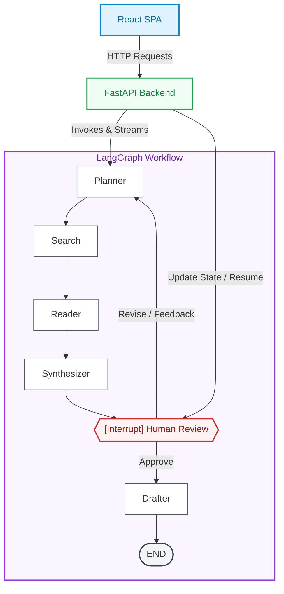

# AI Research Paper Assistant

Asynchronous, multi-agent research workflow built with **FastAPI + LangGraph**
on the backend and a modern animated **React + TypeScript** SPA on the frontend.
The LLM provider is **GitHub Models** accessed via the OpenAI Python SDK.

## Architecture



Key engineering decisions:

* **LangGraph `interrupt_before=["human_review"]`** is the mandated pause point.
  Approval continues past the interrupt; a *revise* decision rewrites the state
  via `update_state` and replays the planner ➜ synthesizer chain.
* **MemorySaver** checkpointer persists per-job state in-process. Swap for
  SQLite/Postgres for multi-replica deployments.
* **Background threads** (`FastAPI.BackgroundTasks`) run the graph so HTTP
  requests return immediately and the React frontend can poll `/api/status/{job_id}`.
* **Rotational LLM Client** (`app/llm.py`) load-balances requests across multiple Groq credentials (e.g., `GROQ_API_KEY_1`, `GROQ_API_KEY_2`, `GROQ_API_KEY_3`) to bypass rate limits. It auto-rotates and retries on failure, with fallback to GitHub Models if no Groq keys are configured.
* **Live Health Monitoring**: Frontend automatically checks backend liveness (`/api/health`) on mount and every 5 seconds, displaying a dynamic, pulsating connection status dot in the header.

## Layout

```
research_assistant/
├── app/
│   ├── __init__.py
│   ├── agents.py    # planner, search, reading, synthesis, review, drafting
│   ├── graph.py     # LangGraph wiring + interrupt
│   ├── llm.py       # GitHub Models OpenAI client
│   ├── main.py      # FastAPI app + routes
│   ├── search.py    # ArXiv API adapter
│   └── state.py     # ResearchState TypedDict + Pydantic API models
├── frontend/        # React + TS Frontend (Vite)
│   ├── src/         # Main React components & design assets
│   ├── dist/        # Production compiled assets served by FastAPI
│   └── package.json
├── requirements.txt
└── README.md
```

## Setup

```bash
cd research_assistant
python -m venv .venv && source .venv/bin/activate
pip install -r requirements.txt

# Configure credentials (either Groq or GitHub Models)

# Option A: Groq API with credential rotation (Recommended to avoid rate limits)
export GROQ_API_KEY_1=gsk_xxx
export GROQ_API_KEY_2=gsk_yyy
export GROQ_API_KEY_3=gsk_zzz
# Optional: export GROQ_MODEL=llama-3.3-70b-versatile

# Option B: GitHub Models fallback
export GITHUB_TOKEN=ghp_xxx_your_github_models_token
# Optional: export GITHUB_MODEL=openai/gpt-4.1
```

## Run

For detailed setup, configuration, and options, see [DEPLOY.md](DEPLOY.md).

### 🚀 Production Mode (Single-Server)
Build the React production assets and serve everything via FastAPI:
```bash
# 1. Build React production bundle
cd frontend
npm install
npm run build
cd ..

# 2. Run single FastAPI server
export GITHUB_TOKEN=ghp_xxx_your_github_models_token
uvicorn app.main:app --host 0.0.0.0 --port 8000
```
Open [http://localhost:8000](http://localhost:8000) in your browser.

### 🛠️ Development Mode (Dual-Server)
Run backend and React dev servers separately:
```bash
# Terminal 1 — Backend
export GITHUB_TOKEN=ghp_xxx_your_github_models_token
uvicorn app.main:app --host 0.0.0.0 --port 8000

# Terminal 2 — React Frontend
cd frontend
npm run dev
```
Open [http://localhost:5173](http://localhost:5173) in your browser.

## API surface

| Method | Path                              | Purpose                                  |
|--------|-----------------------------------|------------------------------------------|
| GET    | `/api/health`                     | Liveness probe                           |
| POST   | `/api/start-research`             | `{topic}` → `{job_id, status}`           |
| GET    | `/api/status/{job_id}`            | Full state snapshot + `awaiting_review`  |
| POST   | `/api/submit-feedback/{job_id}`   | `{decision: approve\|revise, feedback?}` |
